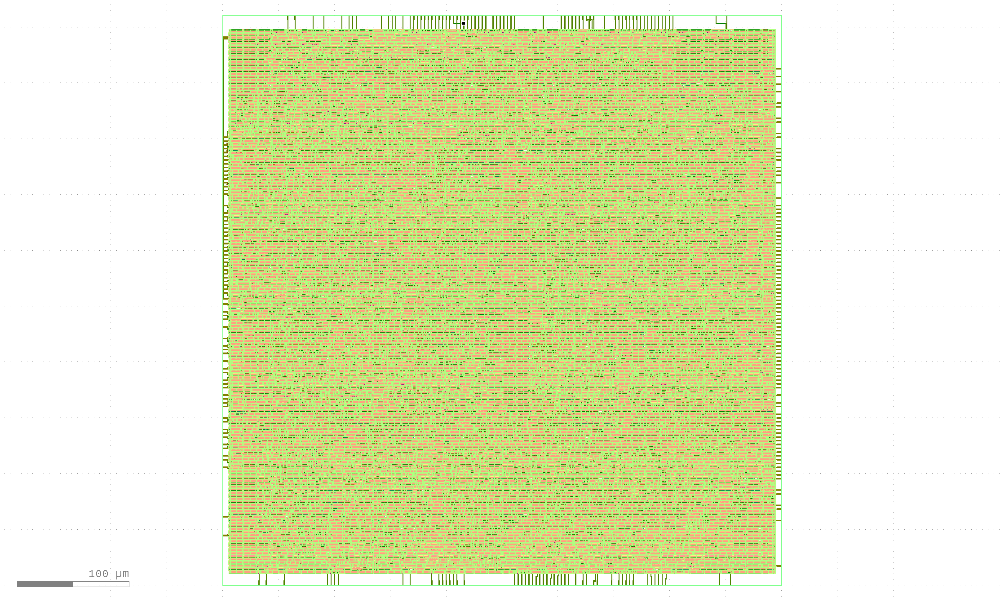
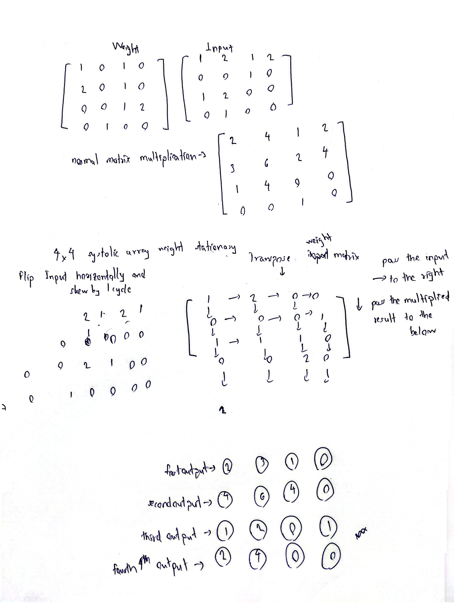

# 4x4 MAA(Matrices-Are-Awesome) Systolic Array 


As a person who enjoys meticulous calculations and structure, matrices have always been facsinating to me. I like the way they transform and different ways to get different results out of these structures. So, I have worked on a project that resonates with my personal intersts, **a weight-stationary systolic array accelerator for neural-network inference**. This accelerator does general matrix-matrix multiplication with weight stationary method. This project includes hand-written RTL,cycle-accurate verification, a full open-source Sky130 ASIC flow to real GDSII.




## Summary

| | |
|---|---|
| **Function** | int8 GEMM accelerator (neural-network inference) |
| **Dataflow** | Weight-stationary systolic array, 4×4 (16 PEs) |
| **Technology** | SkyWater Sky130 (130 nm), `sky130_fd_sc_hd` |
| **Die area** | **0.255 mm²** (core 0.238 mm²) — *post-layout, measured* |
| **Cell area** | 0.069 mm², 7,350 std cells — *synthesis, measured* |
| **Fmax** | ~102 MHz — *pre-layout STA* |
| **Power** | ~44 mW @ 100 MHz — *pre-layout estimate* |
| **Throughput** | 3.28 GOPS · ~74 GOPS/W · ~48 GOPS/mm² |
| **int8 accuracy** | 2.2% vs fp32 on a small MLP — *measured* |
| **Verification** | RTL matches numpy golden bit-exact, cycle-for-cycle (4×4 & 8×8) |
| **Flow** | RTL → Yosys → OpenSTA → OpenLane P&R → **GDSII (complete, not fabricated)** |


The array implements GEMM:

Y[M,N] = X[M,K] · W[K,N]

using an R×C grid of processing elements (PEs). If K>R or N>C, the host divides the operation into R×C tiles and accumulates the partial results across the K dimension (exp/tiling.py).

Tiling and accumulation are currently handled on the host. A real implementation would need an on-chip controller for this and it is not implemented yet.

## Weight-stationary dataflow

```
            west (activations, skewed: row r delayed r cycles)
            │
   X[*,0] ─►┌─────┬─────┬─────┐
   X[*,1] ─►│PE   │PE   │PE   │   each PE holds W[r,c]
   X[*,2] ─►│ w00 │ w01 │ w02 │   psum_out = psum_in + w*a_in
            └──┬──┴──┬──┴──┬──┘   a flows east, psum flows south
               ▼     ▼     ▼
             Y[*,0] Y[*,1] Y[*,2]   (south edge, de-skewed)
```
             
Weights are loaded into all PEs in parallel with one load_w pulse and then remain stationary.
Activations enter from the west and propagate east. The input rows are skewed so that the required operands reach each PE at the correct cycle.
Partial sums propagate from north to south, with the completed results appearing at the south edge.
This allows the same weight values to be reused while multiple activation rows pass through the array.


**Example Calculation is shown below**



---

## Results

**1. RTL verified** The array's output matches a numpy golden
reference exactly, cycle-for-cycle, at 4×4 across multiple seeds
(cocotb + Icarus).

**2. int8 inference accuracy.** A small MLP (16→32→16→4, ReLU/tanh) run with
every layer as an int8 GEMM on the array:

```
int8 vs fp32 output relative error : 2.2%   (max abs 0.016)
```


**3. Area (Sky130, measured).** 

| Array | PEs | Std cells | Cell area | Area / PE |
|-------|-----|-----------|-----------|-----------|
| **4 × 4** | **16** | **7,350** | **0.069 mm²** | **4,343 µm²** |


Near-linear scaling (4× PEs → 4.19× area), arithmetic-dominated cell mix
(xnor/maj3/xor + 929 flip-flops at 4×4). 

**4. Full place-and-route (OpenLane, Sky130).** 

| Metric | Value |
|--------|-------|
| **Die area** | **0.255 mm²** (core 0.238 mm²) |
| Fmax (pre-layout STA) | 102 MHz (slack meets at 9.77 ns) |
| Peak throughput | 3.28 GOPS (2 × 16 PE × Fmax) |
| Power (pre-layout est.) | ~44 mW |
| Energy / area efficiency | ~74 GOPS/W, ~48 GOPS/mm² |

---

## Verification chain

```
numpy golden  ──►  cycle-accurate funcsim  ──►  RTL (cocotb, Icarus)
 (the answer)      (register-exact model)       (the hardware)
```

---

## Status and future work

Working and verified- the weight-stationary array in RTL, the verification chain,
int8 MLP inference, and the full Sky130 flow to real GDSII (0.255 mm² die). Left
as future work- an on-chip tiling controller, streaming weight load, an on-chip activation unit.
